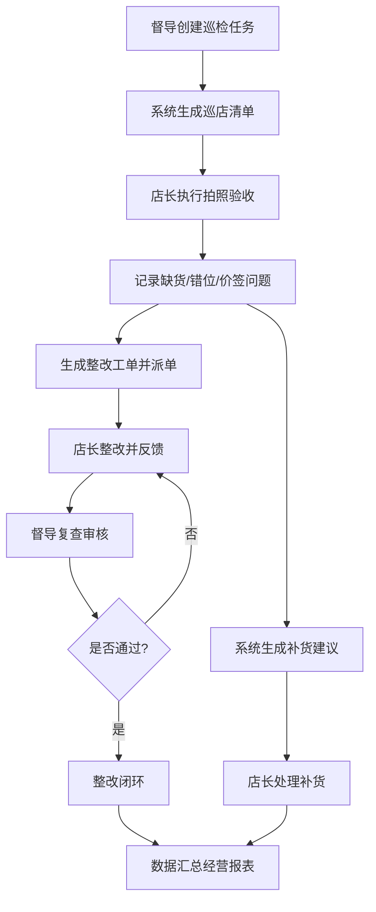

## 1. 产品概述

智慧零售门店陈列巡检平台是面向连锁便利店的数字化运营管理工具，解决传统人工巡检效率低、标准不统一、整改追踪困难等痛点。

- 服务对象：区域督导、门店店长两类核心角色
- 核心价值：标准化陈列管理、可视化巡检流程、数据化经营决策

## 2. 核心功能

### 2.1 用户角色

| 角色 | 登录方式 | 核心权限 |
|------|----------|----------|
| 区域督导 | 账号登录 | 制定陈列标准、创建巡检任务、审核整改结果、查看全部门店报表、导出周报 |
| 门店店长 | 账号登录 | 执行拍照验收、录入整改反馈、查看本门店数据、处理补货建议 |

### 2.2 功能模块

1. **门店地图**：门店分布地图、门店平面图上传、货架标注、客流热区展示
2. **陈列标准**：商品类别标准设置、陈列位置规范、价签/促销牌要求、标准模板
3. **巡检任务**：任务创建、巡店清单生成、任务分配、任务状态追踪
4. **拍照验收**：拍照留痕、缺货记录、错位标注、价签检查、促销牌核验
5. **补货建议**：缺货统计、智能补货推荐、库存预警、补货清单导出
6. **整改跟踪**：问题派单、整改期限设置、店长反馈、复查审核、通过/驳回
7. **经营报表**：门店评分、同城对比、趋势分析、周报导出、角色数据视图

### 2.3 页面详情

| 页面名称 | 模块名称 | 功能描述 |
|---------|---------|---------|
| 门店地图 | 门店列表 | 门店卡片展示、搜索筛选、状态标签 |
| 门店地图 | 门店平面图 | 平面图上传、货架/端架标注拖拽、热区图层切换 |
| 门店地图 | 客流热区 | 热力图叠加、区域统计、时段切换 |
| 陈列标准 | 标准分类 | 商品类别树、标准模板管理 |
| 陈列标准 | 陈列规范 | 陈列位置设置、SKU数量要求、排面规格配置 |
| 陈列标准 | 价签促销 | 价签规范、促销牌要求、特殊陈列说明 |
| 巡检任务 | 任务管理 | 新建任务、任务列表、筛选、分配状态 |
| 巡检任务 | 巡店清单 | 自动生成检查项、检查顺序、权重设置 |
| 拍照验收 | 拍照上传 | 调起摄像头/上传图片、图片标注、批量操作 |
| 拍照验收 | 问题记录 | 缺货标记、错位标注、价签问题、促销问题 |
| 补货建议 | 缺货汇总 | 按门店/类别汇总、SKU缺货排行、TOP榜 |
| 补货建议 | 智能推荐 | 补货数量建议、库存安全线、紧急补货标记 |
| 整改跟踪 | 问题派单 | 指派责任人、设置期限、优先级、描述说明 |
| 整改跟踪 | 店长反馈 | 整改照片上传、整改说明、提交审核 |
| 整改跟踪 | 复查审核 | 审核通过/驳回、复查意见、状态流转 |
| 经营报表 | 门店评分 | 综合评分、分项得分、历史趋势 |
| 经营报表 | 同城对比 | 排名表、雷达图对比、差距分析 |
| 经营报表 | 数据导出 | 周报生成、PDF/Excel导出、自定义时间段 |

## 3. 核心流程

### 3.1 巡检主流程

督导创建巡检任务并下发至门店，店长根据任务清单逐项拍照验收，记录缺货、错位、价签等问题；系统自动生成补货建议，问题项生成整改工单派发给店长；店长完成整改后提交反馈，督导复查通过后闭环，最终数据汇总至经营报表生成门店评分。

## 4. 用户界面设计

### 4.1 设计风格

- **主色**：科技蓝 `#2563EB`，代表专业与信任
- **辅色**：活力橙 `#F97316`（警示/待处理）、成功绿 `#10B981`（通过/达标）、危险红 `#EF4444`（严重问题）
- **中性色**：深灰 `#1F2937`（文本主色）、浅灰 `#F3F4F6`（背景）、边框灰 `#E5E7EB`
- **按钮风格**：圆角 10px，中等圆角，悬浮时有微上浮效果与颜色加深
- **字体**：标题使用 `Noto Sans SC` 粗体，正文使用 `Noto Sans SC` 常规，数字使用 `JetBrains Mono`
- **布局风格**：左侧导航栏 + 顶部状态栏 + 内容卡片区域，采用卡片式容器 + 分区阴影
- **图标风格**：统一使用 Lucide React 线性图标，1.5px 线条宽度
- **质感细节**：渐变背景装饰、玻璃态导航、数据卡片微阴影、关键指标数字动画

### 4.2 页面设计概览

| 页面名称 | 模块名称 | UI元素 |
|---------|---------|--------|
| 门店地图 | 总览 | 左侧门店列表卡片、右侧地图/平面图区域、顶部时间/筛选器 |
| 陈列标准 | 总览 | 左侧分类树、中间标准列表卡片、右侧预览面板 |
| 巡检任务 | 总览 | 顶部统计卡片、任务列表表格、状态标签、操作按钮组 |
| 拍照验收 | 总览 | 检查项进度条、相机区域/图片网格、问题快捷标记面板 |
| 补货建议 | 总览 | TOP缺货排行卡片、补货推荐表格、紧急补货警示条 |
| 整改跟踪 | 总览 | 看板视图（待整改/整改中/待复查/已完成）、工单卡片、进度指示 |
| 经营报表 | 总览 | 顶部KPI指标卡、评分雷达图、趋势折线图、数据表格 |

### 4.3 响应式设计

- 桌面端优先（≥1280px）：左侧 240px 导航 + 主内容区自适应
- 平板端（768-1279px）：左侧导航折叠为图标栏，主内容两栏变单栏
- 移动端（<768px）：顶部汉堡菜单展开导航，卡片垂直堆叠，表格横向滚动
- 触控优化：触控目标最小 44×44px，关键操作按钮加大尺寸
