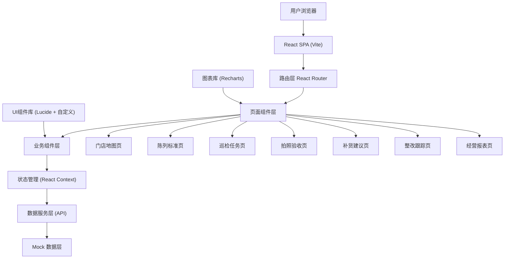
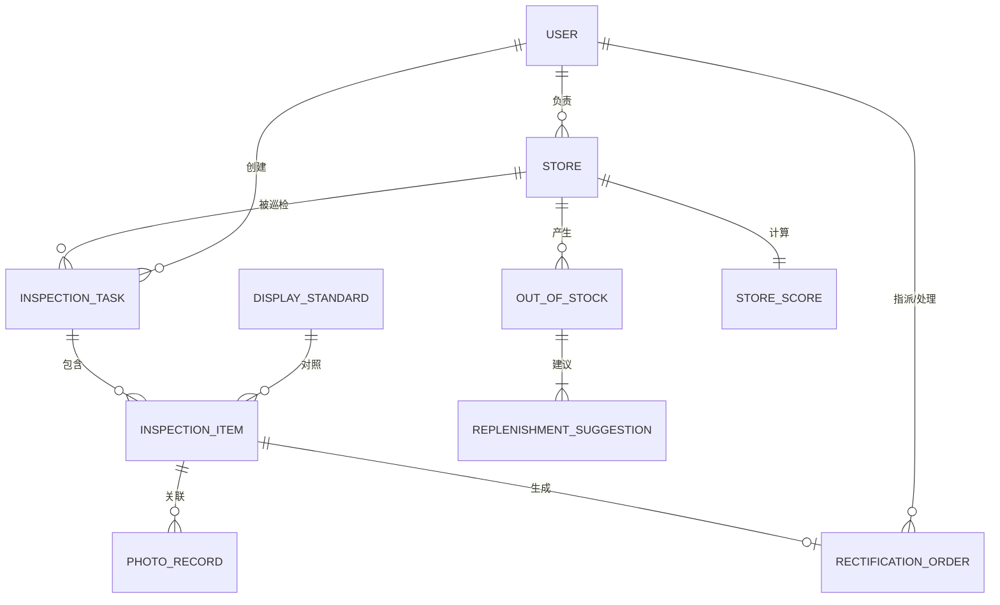

## 1. 架构设计

本项目为纯前端单页应用（SPA），采用前后端分离架构，前端负责页面展示与交互逻辑，后端接口使用 Mock 数据模拟。



## 2. 技术描述

- **前端框架**: React 18 + TypeScript
- **构建工具**: Vite 5.x
- **样式方案**: TailwindCSS 3.x + CSS 变量
- **路由**: React Router DOM 6.x
- **状态管理**: React Context + useReducer
- **图标库**: Lucide React
- **图表库**: Recharts
- **HTTP请求**: Fetch API（无额外axios依赖）
- **数据存储**: LocalStorage + 内存Mock数据
- **日期处理**: 原生 Date API

## 3. 路由定义

| 路由路径 | 页面名称 | 访问角色 |
|---------|---------|---------|
| `/` | 重定向至门店地图 | 全部 |
| `/store-map` | 门店地图 | 督导/店长 |
| `/display-standards` | 陈列标准 | 督导(编辑)/店长(只读) |
| `/inspection-tasks` | 巡检任务 | 督导/店长 |
| `/photo-verification/:taskId` | 拍照验收 | 店长 |
| `/replenishment` | 补货建议 | 督导/店长 |
| `/rectification` | 整改跟踪 | 督导/店长 |
| `/reports` | 经营报表 | 督导(全部)/店长(本店) |

## 4. 数据模型

### 4.1 实体关系图



### 4.2 核心数据类型

```typescript
// 用户
interface User {
  id: string;
  name: string;
  role: 'supervisor' | 'manager';
  avatar: string;
  phone: string;
  storeIds: string[]; // 负责的门店ID列表
  city: string;
}

// 门店
interface Store {
  id: string;
  name: string;
  code: string;
  address: string;
  city: string;
  district: string;
  lat: number;
  lng: number;
  floorPlanUrl?: string;
  shelves: Shelf[];
  heatmapData?: HeatmapZone[];
  managerId: string;
  status: 'normal' | 'warning' | 'critical';
  score: number;
  openDate: string;
}

// 货架
interface Shelf {
  id: string;
  name: string;
  type: 'shelf' | 'endcap' | 'promotion' | 'checkout';
  x: number; // 相对平面图百分比位置
  y: number;
  width: number;
  height: number;
  category?: string;
  levelCount: number;
}

// 客流热区
interface HeatmapZone {
  zoneId: string;
  zoneName: string;
  x: number;
  y: number;
  radius: number;
  intensity: number; // 0-100
}

// 陈列标准
interface DisplayStandard {
  id: string;
  category: string;
  subCategory?: string;
  name: string;
  description: string;
  imageUrl?: string;
  shelfType: string;
  minSkuCount: number;
  maxSkuCount: number;
  facingRule: string;
  priceTagRule: string;
  promotionRule?: string;
  weight: number; // 权重
}

// 巡检任务
interface InspectionTask {
  id: string;
  title: string;
  storeId: string;
  storeName: string;
  creatorId: string;
  creatorName: string;
  assigneeId: string;
  assigneeName: string;
  type: 'weekly' | 'monthly' | 'temporary' | 'promotion';
  status: 'pending' | 'in_progress' | 'completed' | 'overdue';
  items: InspectionItem[];
  startTime: string;
  deadline: string;
  completedAt?: string;
  score?: number;
}

// 检查项
interface InspectionItem {
  id: string;
  standardId: string;
  standardName: string;
  category: string;
  shelfId?: string;
  weight: number;
  status: 'pending' | 'pass' | 'fail' | 'skip';
  photos: PhotoRecord[];
  issues: IssueRecord[];
  remark?: string;
}

// 拍照记录
interface PhotoRecord {
  id: string;
  url: string;
  takenAt: string;
  marks: PhotoMark[];
}

// 照片标注
interface PhotoMark {
  id: string;
  type: 'out_of_stock' | 'misplaced' | 'price_tag' | 'promotion';
  x: number;
  y: number;
  description: string;
}

// 问题记录
interface IssueRecord {
  id: string;
  type: 'out_of_stock' | 'misplaced' | 'price_tag' | 'promotion' | 'display';
  severity: 'low' | 'medium' | 'high';
  description: string;
  skuId?: string;
  skuName?: string;
}

// 整改工单
interface RectificationOrder {
  id: string;
  taskId: string;
  storeId: string;
  storeName: string;
  inspectionItemId: string;
  itemName: string;
  issueId: string;
  issueType: string;
  description: string;
  photos: string[];
  assigneeId: string;
  assigneeName: string;
  assignorId: string;
  assignorName: string;
  deadline: string;
  status: 'pending' | 'processing' | 'reviewing' | 'passed' | 'rejected';
  priority: 'high' | 'medium' | 'low';
  createdAt: string;
  rectification?: {
    description: string;
    photos: string[];
    submittedAt: string;
  };
  review?: {
    result: 'pass' | 'reject';
    comment: string;
    reviewerName: string;
    reviewedAt: string;
  };
}

// 缺货记录
interface OutOfStockRecord {
  id: string;
  storeId: string;
  taskId: string;
  skuId: string;
  skuName: string;
  category: string;
  shelfId?: string;
  recordedAt: string;
  duration: number; // 缺货天数估计
  estimatedSalesLoss: number;
}

// 补货建议
interface ReplenishmentSuggestion {
  id: string;
  storeId: string;
  skuId: string;
  skuName: string;
  category: string;
  currentStock: number;
  safetyStock: number;
  suggestedQty: number;
  urgency: 'normal' | 'urgent' | 'critical';
  lastReplenishedAt: string;
}

// 门店评分
interface StoreScore {
  storeId: string;
  period: string; // 2026-W24 或 2026-06
  periodType: 'weekly' | 'monthly';
  totalScore: number;
  displayScore: number;
  stockScore: number;
  priceScore: number;
  promotionScore: number;
  rectificationScore: number;
  taskCount: number;
  rectificationRate: number;
  rank: number; // 同城排名
}
```

## 5. 目录结构

```
src/
├── assets/              # 静态资源
│   └── images/
├── components/          # 公共组件
│   ├── Layout/          # 布局组件
│   ├── ui/              # UI基础组件
│   ├── charts/          # 图表组件
│   └── common/          # 业务通用组件
├── contexts/            # Context状态管理
│   ├── AuthContext.tsx
│   ├── StoreContext.tsx
│   └── AppContext.tsx
├── data/                # Mock数据
│   ├── mockUsers.ts
│   ├── mockStores.ts
│   ├── mockStandards.ts
│   ├── mockTasks.ts
│   ├── mockOrders.ts
│   └── mockScores.ts
├── hooks/               # 自定义Hooks
├── pages/               # 页面组件
│   ├── StoreMapPage.tsx
│   ├── DisplayStandardsPage.tsx
│   ├── InspectionTasksPage.tsx
│   ├── PhotoVerificationPage.tsx
│   ├── ReplenishmentPage.tsx
│   ├── RectificationPage.tsx
│   └── ReportsPage.tsx
├── router/              # 路由配置
│   └── index.tsx
├── types/               # 类型定义
│   └── index.ts
├── utils/               # 工具函数
├── App.tsx
├── main.tsx
└── index.css
```
